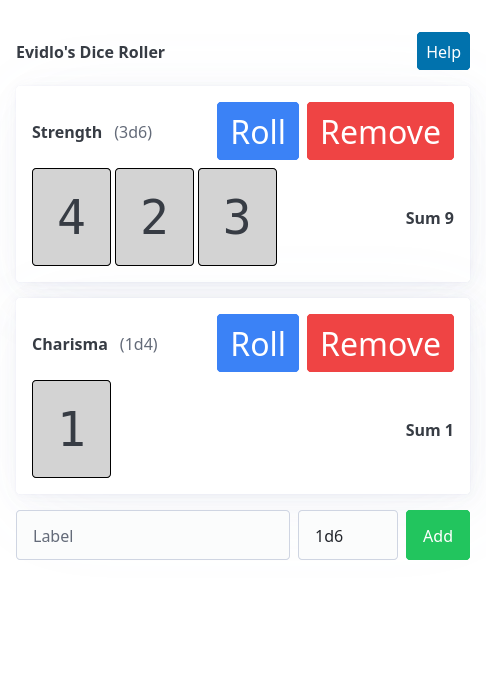

# Dice Roller

This is a little vibe-coded dice roller webapp that supports various [dice notations](https://dice-roller.github.io/documentation/guide/notation/maths.html).

See the original chat used to generate this app [here](chat.txt).

[Webapp](https://evidlo.github.io/dice)

